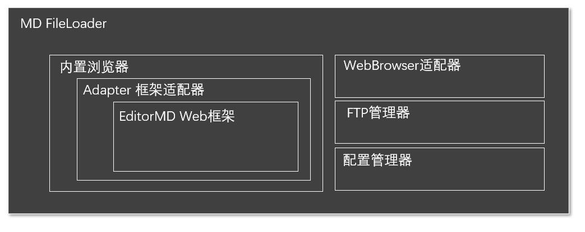

# MD FileLoader 产品设计文档

## 设计原理

EditorMD是一款非常便捷的基于html+JS的md编辑器框架，我们通过Windows内置的Webbrowser对其进行包裹和自动化控制，将这个编辑器框架进行了Winform平台化封装。具体分为以下几个步骤。

1. 根据Webbrowser的最小运行环境需求对.net平台内置的IE浏览器进行深度定制，使其同时兼容Windows7和Windows10，Windows11。
2. 通过在JS层和C#层分别编写适配代码完成C#代码与EditorMD的基本数据交换，实现Winform桌面程序代码对Web框架的遥控。
3. 编写适配器，对需要与EditorMD进行交互的功能进行包裹，如提取图片信息，交换图片链接地址，代码区和预览区的数据同步等
4. 编写独立的FTP模块完成图片的服务器上传

## 代码设计

MD FileLoader基于广泛应用开源的MD框架工具EditorMD，并在此基础上进行二次开发。 程序分为用户UI层，与框架适配层，二者基本分离。由于作者能力有限，程序代码力求以最小的代码量实现所需要的功能，不追求代码的严谨与优雅。

### 结构示意图：

 

### 源代码目录结构如下：
* MDLoader
	* MDLoader.csproj -C#项目文件
	* Form1.CS -主窗体
	* Adapter.cs -EditorMD 框架适配器
	* file.CS -本地目录文件操作
	* FTP.CS -FTP管理器
	* setup.CS -配置管理器
	* WebBrowser.cs -WebBrowser适配器
	* version.txt -版本更新记录
	* bin -发布版本

### 程序运行功能模块介绍

1. 准备程序运行环境（program.cs）
	- 解析传入的参数
	- 通过编辑注册表调整默认的ie运行环境
	- 通过时间戳定义缓寸目录名
	- 错误信息归集化处理

2. 与用户进行命令交互(Form1.cs)
	- 建立一个webrowser的运行环境，进行必要的的初始化
	- 加载editor.md运行框架
	- 框架加载成功后加载用户markdown文件
		- 缓存图片文件到本地
		- 将markdown文件加载到adapter
		- 刷新webbrowser，使文件呈现出来
	- 调用adapter对象中的方法响应用户事件
		- 打开文件
			- LoadMDFile 方法
			- CacheMDPictures 方法
			- SetUserSideMD 方法
		- 新建文件
			- Clear 方法
		- 保存文件
			- SaveFile 方法
		- 另存文件
			- 同上
		- 同步Markdown的工作区大小
			- SetClientSize JS方法
		- 同步用户输入，并刷新图片缓存
			- GetUserSideMD 方法
			- CacheMDPictures 方法
		- 响应用户Ctrl+V操作
			- 将剪切板保存为image目录下的文件，PNG格式
			- 将新的图片markdown标签插入到用户编辑区
		- 处理用户拖拽文件到应用，及超链被点击后的操作
			- 通过Navigating函数读取拖入文件，或者超链点击的文件的路径
			- 根据文件类型，执行操作
				- 首次打开MD文件，则在本窗口打开
				- 二次以上打开MD文件，重新启动本程序的多个副本打开
				- 如果是其他类型文件，调用OS的Shell程序执行
		- 将本地图片上传到FTP服务器
			-FTPUpload 方法
		- 本地图片路径与服务器图片路径的切换
			- SwitchPicture 方法
		- 保存用户配置
			- SetupForm 对象调用
3. Editor.md适配器 (Adapter.CS)
	- public List&lt;string&gt;	 CacheMDPictures(string fileName)
加载markdown文件中描述的图片到本地，每次加载前会比对前次缓冲的目录，仅当缓冲区图片发生变化时重新加载图片缓存。
	- LoadMDFile(string fileName,WebBrowser browser)
加载MD文件到adapter
	- public bool SaveFile(string file)
保存文件到指定目录
	- public void Clear(WebBrowser browser)
清空adapter中的markdown文本，并刷新到浏览器
	- public void FTPUpload(ref DataGridView dgvtorefresh)
上传图片到FTP目录
	- public void GetUserSideMD(WebBrowser browser)
从editor.md重新加载md文本到adapter，防止用户编辑没有被及时更新
	- public void SetUserSideMD(WebBrowser browser)
把更新过的md内容加载到用户编辑器
	- public void SwitchPicture(WebBrowser browser, Picture_mode type)
切换md文本中的图片地址，本地图片与网络图片互相切换
	- public bool GetIfModified()
判断距离上次保存有没有修改过markdown文本内容
4. 浏览器环境模拟器配置 (SetWebbrowser.CS)
	- ChangeWebbrowserMode(int ieMode)
修改Webbrowser控件模拟的IE版本
5. 运行环境配置 (Setup.cs)
	- SetupForm()
从config.xml中加载配置到Config对象
	- public void MoveSplitterTo(PropertyGrid grid, int x)
调整栏目宽度，由于这个方法本身的propertygrid没有公有方法支持，所以需要用反射技术调用私有方法实现
	- 保存
保存配置到config.xml,并重启
	- 读取
读取文件到config
6. 版本信息 (version.txt)
记录版本信息

更详细的请直接阅读源码中的说明, 如果您在阅读代码时发生疑问欢迎与我取得联系，QQ:64034373 好友申请注明MDFileLoader，由于水平有限，bug在所难免，欢迎提交bug，对于有重要贡献的小伙伴将加入contributor列表。
