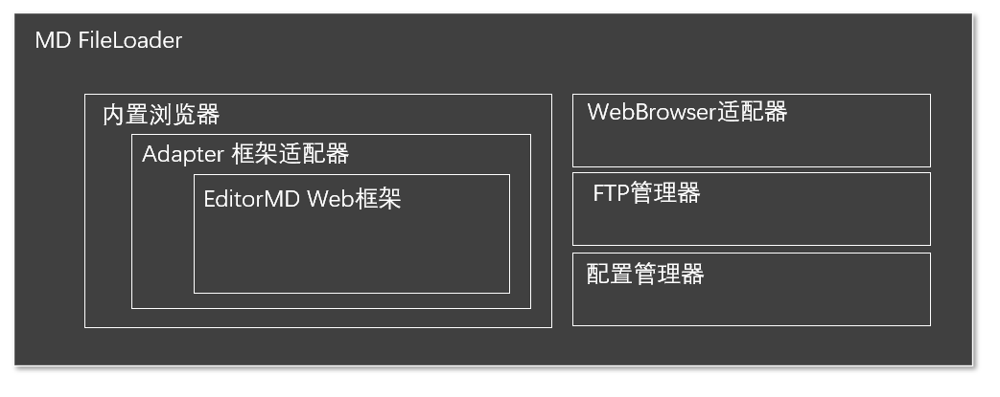

# MD FileLoader 轻量级MD编辑器

## 功能简介

MD FileLoader是一个使用C#开发的轻量级MD编辑器，支持全部的MD标准语法，以及常见的MD扩展语法，如视频，html元素等。我们试图以最小的环境对MD文件的离线编写、在线上传等功能提供支持，以减轻网络文档编写的工作负担。

MD FileLoader现支持以下功能

1.  双栏编辑模式，提供实时的markdown文件编辑预览
2.  编辑的md编辑功能，支持所有标签的菜单化输入。
3.  全屏编辑模式，及全屏预览模式。
4.  Md语法基础及高级功能的在线帮助系统。
5.  图片通过ftp功能上传图床，并自动替换为html链接

MD FileLoader 采用单可执行文件发布，程序目前约为900KB，执行后自动在当前目录建立运行环境。

MD FileLoader 采用mit协议进行发布，源码完全公开，欢迎您使用或进行二次开发。

## 代码设计

MD FileLoader基于广泛应用开源的MD框架工具EditorMD，并在此基础上进行二次开发。 程序分为用户UI层，与框架适配层，二者基本分离。由于作者能力有限，程序代码力求以最小的代码量实现所需要的功能，不追求代码的严谨与优雅。基本功能结构如下：

源代码目录结构如下：

* MDLoader
	* MDLoader.csproj -C#项目文件
	* Form1.CS -主窗体
	* Adapter.cs -EditorMD 框架适配器
	* file.CS -本地目录文件操作
	* FTP.CS -FTP管理器
	* setup.CS -配置管理器
	* WebBrowser.cs -WebBrowser适配器
	* version.txt -版本更新记录
	* bin -发布版本

## 设计原理简介

EditorMD是一款非常便捷的基于html+JS的md编辑器框架，我们通过Windows内置的Webbrowser对其进行包裹和自动化控制，将这个编辑器框架进行了Winform平台化封装。具体分为以下几个步骤。

1. 根据Webbrowser的最小运行环境需求对.net平台内置的IE浏览器进行深度定制，使其同时兼容Windows7和Windows10。
2. 通过在JS层和C#层分别编写适配代码完成C#代码与EditorMD的基本数据交换，实现Winform桌面程序代码对Web框架的遥控。
3. 编写适配器，对需要域EditorMD进行交互的功能进行包裹，如提取图片信息，交换图片链接地址，代码区和预览区的数据同步等
4. 编写独立的FTP模块完成图片的服务器上传
5. 编写独立的xml配置模块，实现程序的配置功能

如果您在阅读代码时发生疑问欢迎与我取得联系，QQ:64034373，由于水平有限，bug在所难免，欢迎提交bug，对于有重要贡献的小伙伴将加入contributor列表。

## Contributor

Fantasy，AndyVane，梦程

